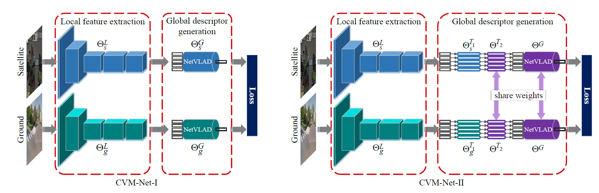

# CVM-Net: Cross-View Matching Network for Image-Based Ground-to-Aerial Geo-Localisation

This project is an initial research on image-based geo-localisation with satellite imagery as reference map. The problem is regarded as image retrieval problem: to query a ground-level image from geo-tagged satellite image database. We propose a deep learning framework to extract global descriptors of ground and satellite images. VGG16 is used to extract local features and NetVLAD layers is used to aggregate to global descriptors. A Siamese-like architecture is used to train the network. To query a ground-level image, we retrieve the satellite image with smallest distance between descriptor of the query image and the satellite image. The position (latitude and longitude) of satellite image centre is the position of the query.

### Abstract
The problem of localization on a geo-referenced aerial/satellite map given a query ground view image remains challenging due to the drastic change in viewpoint that causes traditional image descriptors based matching to fail. We leverage on the recent success of deep learning to propose the CVM-Net for the cross-view image-based ground-to-aerial geo-localization task. Specifically, our network is based on the Siamese architecture to do metric learning for the matching task. We first use the fully convolutional layers to extract local image features, which are then encoded into global image descriptors using the powerful NetVLAD. As part of the training procedure, we also introduce a simple yet effective weighted soft margin ranking loss function that not only speeds up the training convergence but also improves the final matching accuracy. Experimental results show that our proposed network significantly outperforms the state-of-the-art approaches on two existing benchmarking datasets.

### Network Architecture

### Experiment Dataset
We use two existing dataset to do the experiments

- CVUSA datset: a dataset in America, with pairs of ground-level images and satellite images. All ground-level images are panoramic images.  
	The dataset can be accessed from https://github.com/viibridges/crossnet

- Vo and Hays' dataset: a dataset in America, with pairs of ground-level images and satellite images. All ground-level images are a crop of panoramic images.  
	The dataset can be accessed from https://github.com/lugiavn/gt-crossview

### Results
The top 1% recall accuracy

|           |  CVUSA  |   Vo and Hays  |
| --------- | :-----: | :------------: |
| CVM-Net-I |  91.4%  |     67.9%      |
| CVM-Net-I |  87.2%  |     66.6%      |

### Codes
Our CVM-Net is implemented in Tensorflow + python. You can change the parameters in train.py to use different models to train and test the network. 

*input_data.py* is used to read the data and prepared data for the network. It is coded for CVUSA dataset. You need to download the CVUSA dataset from their website and put them into directory /src/CVM-Net/Data/. Please go to *input_data.py* for the details. To use Vo and Hays' dataset, you need to generate your own train_list.txt or test_list.txt.

The model will be saved after each epoch in directory /src/CVM-Net/Models/.  The accuracy on test set is computed after each epoch and is saved in directory /src/CVM-Net/Result/.

### Models
Our network is implemented in Tensorflow. All models are Tensorflow model.

Please download the models from
[here](https://drive.google.com/file/d/1JtXz4q0kONNoEFE9tEfSCxLRuuJUWqIF/view?usp=sharing)

There are two models CVM-Net-I and CVM-Net-II respectively. The models in /init/ directory are the models used to initialise the model. The VGG16 part is initialised by the online model and other parts are initialised randomly. The other models are our trained models. You can use it to do evaluation.

Please copy the model to \src\Model\CVM-Net-I\ or \src\Model\CVM-Net-II\ to let the network load the model.

We trained on a workstation with two NVIDIA 1080Ti GPUs. It took about 3 days.

### Publications
This work is published in CVPR 2018.  
[CVM-Net: Cross-View Matching Network for Image-Based Ground-to-Aerial Geo-Localisation](http://openaccess.thecvf.com/content_cvpr_2018/papers/Hu_CVM-Net_Cross-View_Matching_CVPR_2018_paper.pdf)

If you are interested in our work and use our code, we are pleased that you can cite the following publication:  
*Sixing Hu, Mengdan Feng, Rang M. H. Nguyen, Gim Hee Lee. CVM-Net: Cross-View Matching Network for Image-Based Ground-to-Aerial Geo-Localization. In IEEE Conference on Computer Vision and Pattern Recognition (CVPR), June 2018.*

@InProceedings{Hu_2018_CVPR,  
author = {Hu, Sixing and Feng, Mengdan and Nguyen, Rang M. H. and Lee, Gim Hee},  
title = {CVM-Net: Cross-View Matching Network for Image-Based Ground-to-Aerial Geo-Localization},  
booktitle = {The IEEE Conference on Computer Vision and Pattern Recognition (CVPR)},  
month = {June},  
year = {2018}  
}

### Acknowledgement
This work is finished in Department of Computer Science, National University of Singapore, Singapore.
